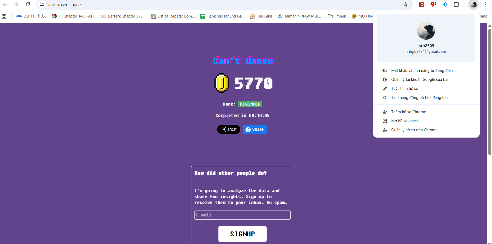
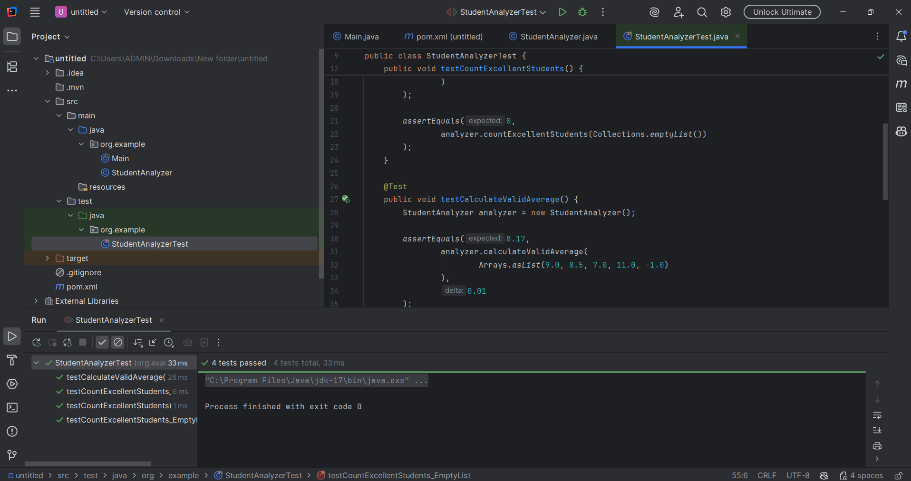
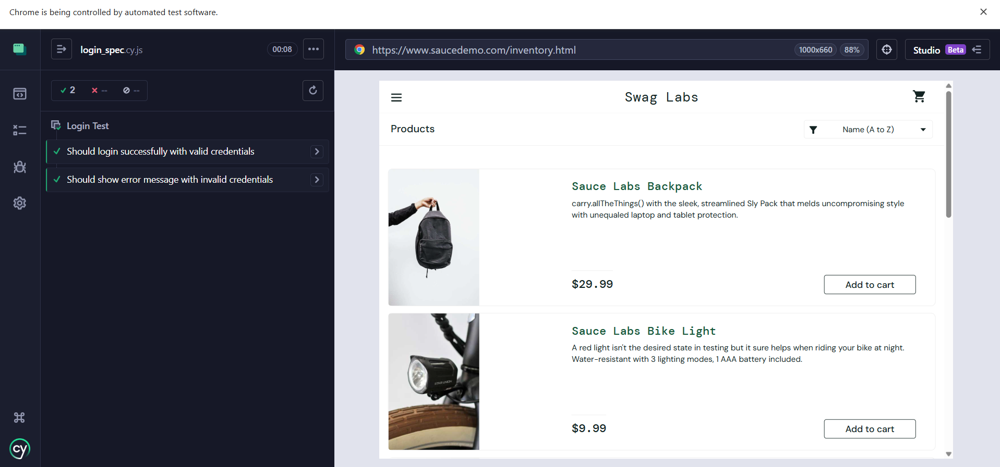
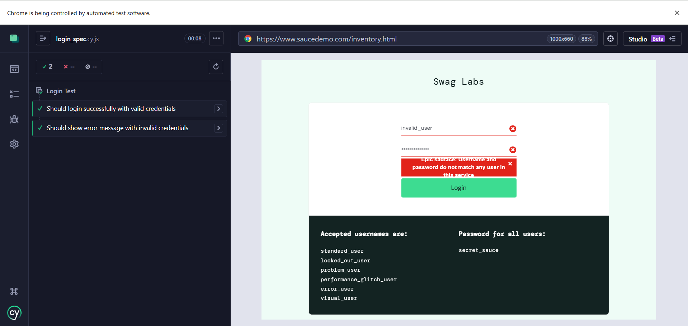
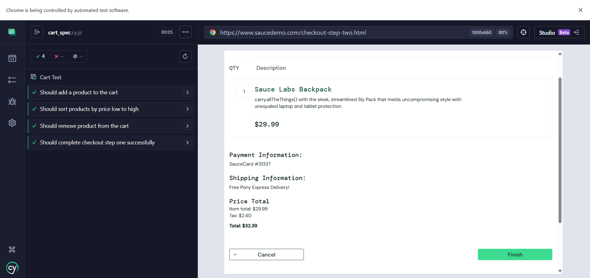
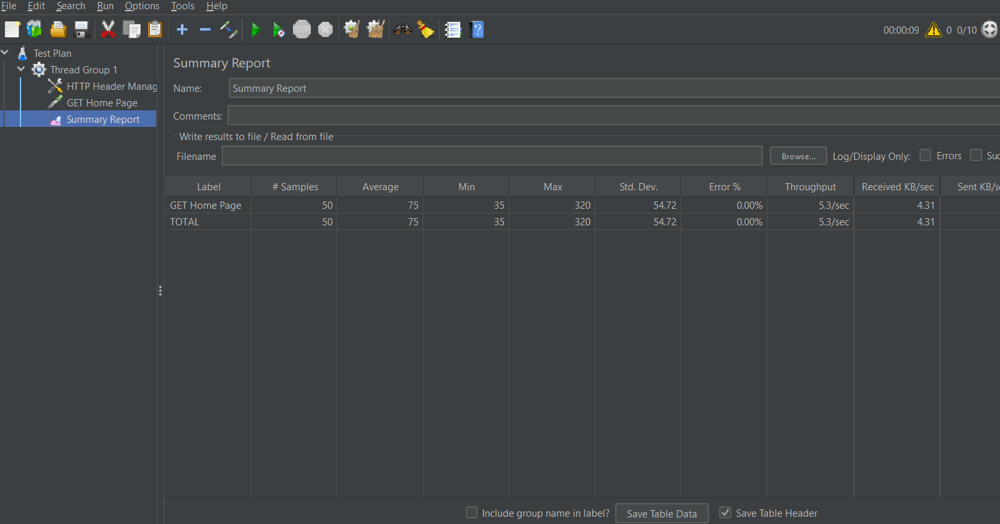
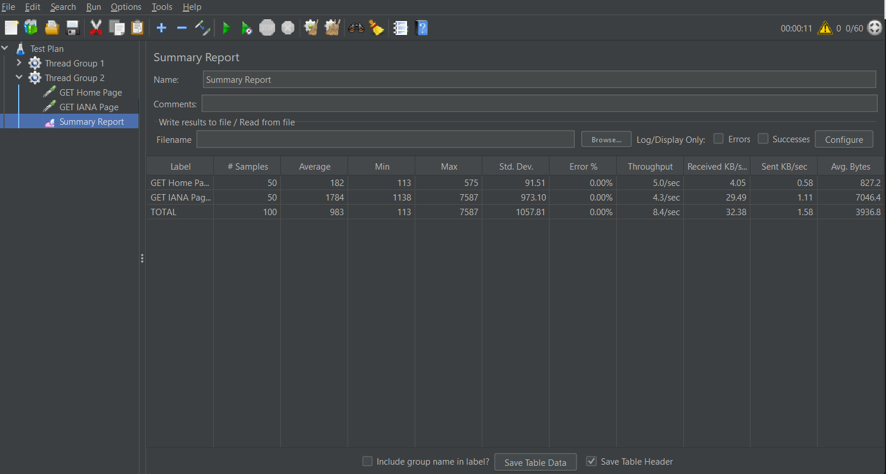
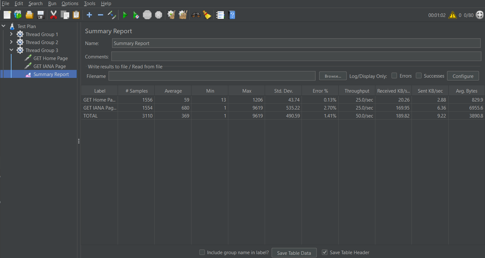

- Người thực hiện : Lê Nguyễn Thanh Phúc
- Mã sinh viên : bit230325


### Kết quả thực hành tuần 1_trải nghiệm chất lượng giao diện phần mềm với https://cantunsee.space/ 



## Kết quả thực hành tuần 2
Dự án Student Grade Analysis là bài thực hành kiểm thử đơn vị (Unit Testing) nhằm áp dụng JUnit 5 để kiểm tra tính đúng đắn của các phương thức xử lý điểm số học sinh được viết bằng Java.
-Dự án thực hành kiểm thử đơn vị (Unit Testing) cho hệ thống phân tích điểm số học sinh sử dụng Java và JUnit 5.

Mô tả dự án
Chương trình cung cấp lớp `StudentAnalyzer` để phân tích danh sách điểm số của học sinh với các quy tắc sau:

- countExcellentStudents
  - Đếm số học sinh đạt loại Giỏi
  - Điều kiện: điểm ≥ 8.0

- calculateValidAverage
  - Tính điểm trung bình của các điểm hợp lệ

- Validation
  - Chỉ chấp nhận điểm trong khoảng 0 – 10
  - Bỏ qua các giá trị nhỏ hơn 0 hoặc lớn hơn 10
  - Nếu danh sách rỗng, trả về kết quả mặc định là 0

Công nghệ sử dụng
-Ngôn ngữ: Java 17.
-Framework kiểm thử: JUnit 5 (Jupiter).
-Công cụ quản lý dự án: Maven.
-Hỗ trợ: AI Generative (Thought Partner) trong quá trình lập trình và thiết kế ca kiểm thử.

Kết quả :



## Kết quả thực hành tuần 3

### 1. Thông tin chung

Môn học: Kiểm thử phần mềm

Bài thực hành: Kiểm thử tự động End-to-End với Cypress

Công cụ sử dụng:

     Node.js
     Cypress
     IntelliJ IDEA Community
Website kiểm thử: [https://www.saucedemo.com](https://www.saucedemo.com)


### 2. Môi trường và công cụ

Hệ điều hành: Windows

Node.js: Phiên bản 14 trở lên

IDE: IntelliJ IDEA Community

Framework kiểm thử: Cypress


### 3. Cấu trúc thư mục dự án

```
cypress-exercise/
 ├── cypress/
 │   └── e2e/
 │       ├── login_spec.cy.js
 │       └── cart_spec.cy.js
 ├── node_modules/
 ├── cypress.config.js
 ├── package.json
 └── package-lock.json
```
### 4. Code
Kiểm thử xóa sản phẩm khỏi giỏ hàng:

it('Should remove product from the cart', () => {
cy.get('.inventory_item').first().find('.btn_inventory').click();
cy.get('.shopping_cart_badge').should('have.text', '1');

// Remove
cy.get('.inventory_item').first().find('.btn_inventory').click();

cy.get('.shopping_cart_badge').should('not.exist');
});

Kiểm thử quy trình thanh toán:

it('Should complete checkout step one successfully', () => {
cy.get('.inventory_item').first().find('.btn_inventory').click();
cy.get('.shopping_cart_link').click();
cy.get('#checkout').click();

cy.get('#first-name').type('John');
cy.get('#last-name').type('Doe');
cy.get('#postal-code').type('12345');

cy.get('#continue').click();
cy.url().should('include', '/checkout-step-two.html');
});

### 5. Kết quả thực hiện





## Kết quả thực hành tuần 4


## 1. Mục tiêu
- Hiểu cách sử dụng Apache JMeter để thực hiện kiểm thử hiệu năng website.
- Thiết kế các kịch bản kiểm thử với các tham số khác nhau (số lượng người dùng, thời gian chạy, hành vi).
- Phân tích các chỉ số hiệu năng như Response Time, Throughput, Error Rate.


## 2. Website được kiểm thử
- **URL**: https://www.example.com
- **Mô tả**: Example.com là website mẫu dùng cho mục đích minh họa và thử nghiệm. Website có cấu trúc đơn giản, phù hợp cho việc thực hành kiểm thử hiệu năng bằng JMeter.

## 3. Công cụ và môi trường
- **Apache JMeter**: 5.6.3
- **Java**: JDK 8+
- **IDE**: IntelliJ IDEA Community Edition 
- **Listener sử dụng**: Summary Report

## 4. Cấu hình chung
- Sử dụng **HTTP Request Defaults**:
    - Protocol: `https`
    - Server Name: `www.example.com`


## 5. Các kịch bản kiểm thử

### 5.1 Thread Group 1 – Kịch bản cơ bản
- **Số lượng người dùng**: 10
- **Loop Count**: 5
- **Hành vi**: HTTP GET đến trang chủ (`/`)

#### Kết quả
- Samples: 50
- Average Response Time: **75 ms**
- Min / Max: 35 ms / 320 ms
- Error Rate: **0.00%**
- Throughput: **5.3 requests/sec**

#### Nhận xét
- Website phản hồi nhanh và ổn định với lượng người dùng nhỏ.
- Không xuất hiện lỗi trong quá trình kiểm thử.
- Phù hợp với các truy cập thông thường.

### 5.2 Thread Group 2 – Kịch bản tải nặng
- **Số lượng người dùng**: 50
- **Ramp-up Period**: 30 giây
- **Hành vi**:
    - HTTP GET trang chủ (`/`)
    - HTTP GET trang con (`/iana`)

#### Kết quả
- Tổng samples: 100
- Average Response Time:
    - Trang chủ: **182 ms**
    - Trang con: **1784 ms**
- Max Response Time: **7587 ms**
- Error Rate: **0.00%**
- Throughput tổng: **8.4 requests/sec**

#### Nhận xét
- Khi số lượng người dùng tăng, thời gian phản hồi tăng rõ rệt, đặc biệt ở trang con.
- Website vẫn hoạt động ổn định, không ghi nhận lỗi.
- Throughput tăng so với kịch bản cơ bản, cho thấy hệ thống xử lý được tải cao hơn.


### 5.3 Thread Group 3 – Kịch bản tùy chỉnh
- **Số lượng người dùng**: 20
- **Thời gian chạy**: 60 giây
- **Hành vi**:
    - HTTP GET trang chủ (`/`)
    - HTTP GET trang con (`/iana`)

#### Kết quả
- Tổng samples: 3110
- Average Response Time:
    - Trang chủ: **59 ms**
    - Trang con: **680 ms**
- Max Response Time: **9619 ms**
- Error Rate tổng: **1.41%**
- Throughput tổng: **50.0 requests/sec**

#### Nhận xét
- Throughput cao nhất trong ba kịch bản do thời gian chạy dài.
- Xuất hiện một tỷ lệ lỗi nhỏ (1.41%) khi hệ thống chịu tải liên tục.
- Trang chủ vẫn phản hồi rất nhanh, trong khi trang con có độ trễ cao hơn.


## 6. So sánh và phân tích tổng hợp

| Kịch bản | Users | Avg Response Time | Throughput | Error Rate |
|--------|-------|-------------------|------------|------------|
| Thread Group 1 | 10 | ~75 ms | 5.3/sec | 0% |
| Thread Group 2 | 50 | ~983 ms | 8.4/sec | 0% |
| Thread Group 3 | 20 | ~369 ms | 50.0/sec | 1.41% |

- Response Time tăng khi tải tăng hoặc khi truy cập trang con.
- Throughput cao nhất ở kịch bản chạy lâu (Thread Group 3).
- Error Rate chỉ xuất hiện khi hệ thống bị stress liên tục.


## 7. Kết luận
- Website https://www.example.com hoạt động ổn định với tải thấp và trung bình.
- Khi tải tăng cao và kéo dài, hiệu năng giảm và xuất hiện một tỷ lệ lỗi nhỏ.
- Apache JMeter là công cụ hiệu quả để kiểm thử hiệu năng và phân tích khả năng chịu tải của website.
- Bài thực hành giúp hiểu rõ hơn về cách thiết kế kịch bản kiểm thử và đọc kết quả hiệu năng.


## 8. Kết quả
- File Test Plan JMeter (`TestPlan.jmx`)
  
  
  


## Kết quả thực hành tuần 5